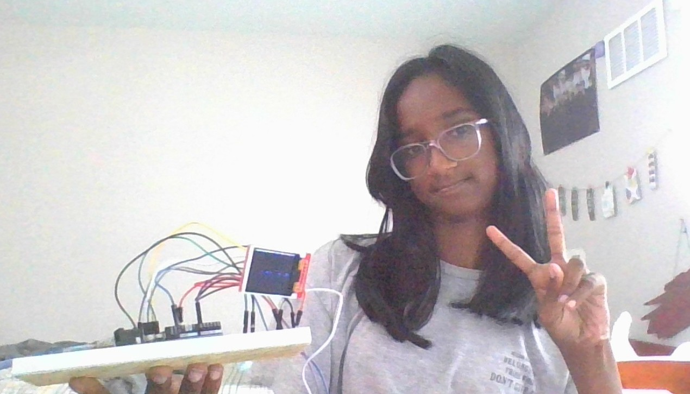
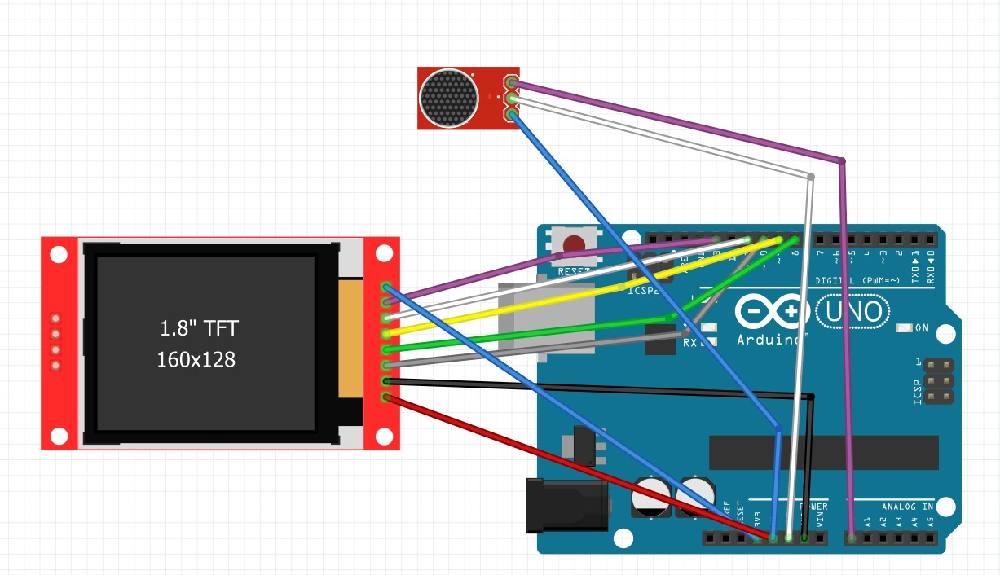

# Audio Visualizer
My project, the Audio Visualizer, was an interesting project that had challenges. I had to switch displays because of power issues, but in the end, I have no regrets. The project has a display which shows the audio visualizer bars on the screen, in live reaction to music or sound. It’s really satisfying to see the visuals respond instantly to changes in the audio, bringing the sound to life in a new way.

| **Engineer** | **School** | **Area of Interest** | **Grade** |
|:--:|:--:|:--:|:--:|
| Harini P | West High School | Software Engineering | Incoming Freshman

**Replace the BlueStamp logo below with an image of yourself and your completed project. Follow the guide [here](https://tomcam.github.io/least-github-pages/adding-images-github-pages-site.html) if you need help.**


  
# Final Milestone

<iframe width="560" height="315" src="https://www.youtube.com/embed/XrU3acGw_BY" title="Harini P Milestone 3" frameborder="0" allow="accelerometer; autoplay; clipboard-write; encrypted-media; gyroscope; picture-in-picture; web-share" referrerpolicy="strict-origin-when-cross-origin" allowfullscreen></iframe>
<br>
Since milestone 2, I've worked around my error succesfully. The screen is now fully reacting to all sound smoothly.  Instead of drawing rectangles for each bar, which was slow, I instead drew 2 verticle lines for them. The bars were being drawn faster, but they still weren't going away. To solve that issue, I drew two black lines over the bars to seemingly erase them before the new ones came in, fixing the error completely. My biggest challenge at BSE was probably this error. Before solving it, I was thinking about just switching back to the LED Matrix. Thankfully, I pushed on, leading me into one of my triumphs: fixing the error! My other triumph was being able to code for the TFT LCD display without even having it on hand! Luckily for me, I didn't need to do much debugging, only fixing the frozen screen! 
Over my time at BSE, I learned many new things about audio. I've learned about the Fast Fourier Transform (FFT), which is a method that breaks down sound into smaller pieces and analyzes their frequencies. I also learned more about frequencies annd a little about PWM (Pulse Width Modulation) which is a technique that controls the amount of power delivered to a device by varying the duration of pulses in a signal. After BSE, I hope to be able to continue exploring about audio in general, as it interests me a lot. 

# Second Milestone

<iframe width="560" height="315" src="https://www.youtube.com/embed/mKDgi6pT2Xo" title="Harini P Milestone 2" frameborder="0" allow="accelerometer; autoplay; clipboard-write; encrypted-media; gyroscope; picture-in-picture; web-share" referrerpolicy="strict-origin-when-cross-origin" allowfullscreen></iframe>
<br>
Since my second milestone, I've figured out my modification. My modicfication is that the bars will be relfected over a line in the center of the display, and the louder portions will be red and the quieter parts will be blue. A challenge that I faced while working toward my modification, was that I was orginally planning to use a rainbow LED display. After some extra research, we figured out that the display was unable to be supported by my Arduino due to power issues. So, we had to find an entirely new way to display the Audio visualizer. So, we decided to use a TFT LCD display. It's liek a mini phone screen, which made it easier. I also had to code for a part I didn't have on hand, which was challenging at first, but ended up working out as I did not need to debug anything! A challenge I am facing right now, though, is that the rate at which the frames of the bars are changing is too slow. It often gets stuck at one place. So, before my final milestone, my goal is to fix the frames so they move somewhat smoothly.

# First Milestone

<iframe width="560" height="315" src="https://www.youtube.com/embed/ZzvixJHYUk0" title="Harini P Milestone 1" frameborder="0" allow="accelerometer; autoplay; clipboard-write; encrypted-media; gyroscope; picture-in-picture; web-share" referrerpolicy="strict-origin-when-cross-origin" allowfullscreen></iframe>
<br>
My project is a DIY audio visualizer using an Arduino Nano, a 32×8 MAX7219 LED matrix, and a microphone module. The goal is to capture live audio, analyze it using the Fast Fourier Transform (FFT), and display the sound frequencies as moving bars on the LED matrix. The Arduino reads analog sound data from a microphone connected to pin A0 and uses the arduinoFFT library to convert that sound into its frequency components. These frequency values are then mapped to visual bar heights, which are displayed in real-time on the LED matrix using the MD_MAX72XX library. One of the challenges I faced was fine-tuning sensitivity for my environment. Thankfull, I found the optimal sensitivity (4.9). The other challenge that I am facing is that there seem to be 2 filled bars at the left hand side of my matrix. They are due to other noises that my mic is picking up. I would like to resolve this issue moving forward. I also plan to explore more visual effects and possibly expand to a color LED matrix for a cooler look. 

# Schematics 


# Code
```c++
#include <arduinoFFT.h>
#include <SPI.h>
#include <Adafruit_GFX.h>
#include <Adafruit_ST7735.h>

#define TFT_CS     10
#define TFT_RST    8
#define TFT_DC     9

Adafruit_ST7735 tft = Adafruit_ST7735(TFT_CS, TFT_DC, TFT_RST);
arduinoFFT FFT = arduinoFFT();

double vReal[64];
double vImag[64];
float sensitivity = 2;

void setup() {
  tft.initR(INITR_BLACKTAB);
  tft.setRotation(3);
  tft.fillScreen(ST77XX_BLACK);
}

void loop() {
  for (int i = 0; i < 64; i++) {
    vReal[i] = analogRead(A0) / sensitivity;
    vImag[i] = 0;
  }

  FFT.Windowing(vReal, 64, FFT_WIN_TYP_HAMMING, FFT_FORWARD);
  FFT.Compute(vReal, vImag, 64, FFT_FORWARD);
  FFT.ComplexToMagnitude(vReal, vImag, 64);

  for (int i = 0; i < 32; i++) {
    vReal[i] = constrain(vReal[i], 0, 80);
    int h = map(vReal[i], 0, 64, 0, 64);
    int limit = 32;
    int quietHeight = min(h, limit);
    int loudHeight = max(h - limit, 0);
    int x = i * 5;

    // Only draw 2 lines (centered in each 5px-wide bar)
    int barX = x + 1;

    // === TOP ===
    // Clear (black) from top to just above the active line
    tft.drawFastVLine(barX, 0, 64 - h, ST77XX_BLACK);

    // Draw quiet + loud lines
    tft.drawFastVLine(barX, 64 - quietHeight, quietHeight, ST77XX_RED);
    tft.drawFastVLine(barX, 64 - h, loudHeight, ST77XX_BLUE);

    // === BOTTOM ===
    // Clear (black) from bottom up to below the active line
    tft.drawFastVLine(barX, 64 + h, 128 - (64 + h), ST77XX_BLACK);

    // Draw mirrored quiet + loud lines
    tft.drawFastVLine(barX, 64, quietHeight, ST77XX_RED);
    tft.drawFastVLine(barX, 64 + quietHeight, loudHeight, ST77XX_BLUE);

    tft.drawFastVLine(1,0,128 , ST77XX_BLACK);
    tft.drawFastVLine(6,0,128 , ST77XX_BLACK);
  }

  delay(5);
}

```

# Bill of Materials

| **Part** | **Note** | **Price** | **Link** |
|:--:|:--:|:--:|:--:|
| Bewinner 1.8inch LCD Display Module, TFT Screen Module | Displaying the bars | $8.99 | <a href="https://www.amazon.com/Bewinner-Resolution-Interface-Full-Color-Controller/dp/B083NYBN4Q?crid=12S2ZGBOVSY5H&dib=eyJ2IjoiMSJ9.fyDKEDaZ-SyYFjeeQWmIjKWSAgGv-rWQCzs6OfFR8Y7okFbQSezTTtBCWPs1wzE6a1V_QVDZ1E99UO7Tp9eEm1IuW8Ngh2twohn67HUODXx5IwdpR1JoKbwx3zTkfhnZvQzP4BeW9n0xwkcrFOm3cEV4tJC7GCgrMZ7uqLtYkB-NkikdItOMrXx0i7WK4QpT5xV1cRUsk_-5BveME4UV_09UUJHAzju6gYxvLkfTKrvBa7_bI6ddOxaA__-5kIZ_NXvnLdbZk170u6G9DcvXosexiuo-iM-fPlQr9ABYJq0.FNCMjCtO3RvX36toQqV2QU9O40AlQIUzNOcba9rDbGM&dib_tag=se&keywords=ST7735+TFT&qid=1752499772&s=electronics&sprefix=st7735+tft%2Celectronics%2C114&sr=1-3"> Link </a> |
| ELEGOO UNO R3 Project Most Complete Starter Kit | Used the arduino, wires, breadboard | $59.99 | <a href="https://www.amazon.com/EL-KIT-001-Project-Complete-Starter-Tutorial/dp/B01CZTLHGE/ref=sr_1_1_sspa?crid=2660U55Y4R0BQ&dib=eyJ2IjoiMSJ9.-TMWe7jTY1L2k9FBx9xn49qwFiVQDbHTh9labdWt--hedwkviIJguyezw59BW6r90ocCa4MEtGLi56YYbLjLLzufLJsiRGHx4fL574GMTqedpFL0DJiXW0naRr3GAqJJmM41oVgH0HZxcTAeCaD_2sXXTOliSzkPmxPHG2SKI-GSnG906aa5ey_ea7BF6XossbZJkRT0-NLuuJ5MKADgXfW8PJcmfs-fOio56KSPLOvjNhGF5LTXZyWIv13zuWcY3fmPN3MIp79sS0stz47wQDDnndnCJfLeMAujrGr_13U.OrzmQdKGXHvOifiPbKLaUI-t0BpSMIAR9yIRS2cvSu8&dib_tag=se&keywords=the%2Bmost%2Bcomplete%2Bstart%2Bkit%2Barduino%2Buno%2Belegoo&qid=1753460091&s=electronics&sprefix=the%2Bmost%2Bcomplete%2Bstart%2Bkit%2Barduino%2Buno%2Belegoo%2Celectronics%2C145&sr=1-1-spons&sp_csd=d2lkZ2V0TmFtZT1zcF9hdGY&th=1"> Link </a> |
